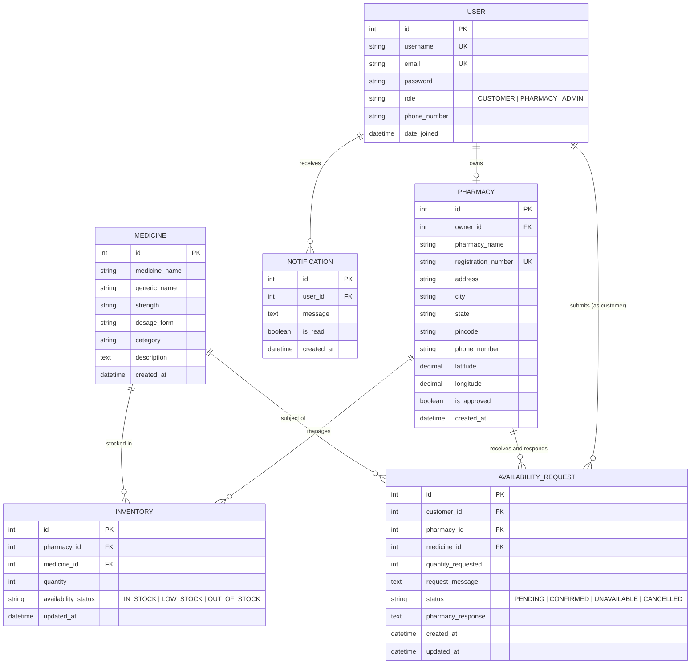

# MediFind – Entity Relationship (ER) Diagram

```mermaid
erDiagram
    USER ||--o| PHARMACY : "owns"
    USER ||--o{ AVAILABILITY_REQUEST : "submits (as customer)"
    USER ||--o{ NOTIFICATION : "receives"
    
    PHARMACY ||--o{ INVENTORY : "manages"
    PHARMACY ||--o{ AVAILABILITY_REQUEST : "receives and responds"
    
    MEDICINE ||--o{ INVENTORY : "stocked in"
    MEDICINE ||--o{ AVAILABILITY_REQUEST : "subject of"

    USER {
        int id PK
        string username UK
        string email UK
        string password
        string role "CUSTOMER | PHARMACY | ADMIN"
        string phone_number
        datetime date_joined
    }

    PHARMACY {
        int id PK
        int owner_id FK
        string pharmacy_name
        string registration_number UK
        string address
        string city
        string state
        string pincode
        string phone_number
        decimal latitude
        decimal longitude
        boolean is_approved
        datetime created_at
    }

    MEDICINE {
        int id PK
        string medicine_name
        string generic_name
        string strength
        string dosage_form
        string category
        text description
        datetime created_at
    }

    INVENTORY {
        int id PK
        int pharmacy_id FK
        int medicine_id FK
        int quantity
        string availability_status "IN_STOCK | LOW_STOCK | OUT_OF_STOCK"
        datetime updated_at
    }

    AVAILABILITY_REQUEST {
        int id PK
        int customer_id FK
        int pharmacy_id FK
        int medicine_id FK
        int quantity_requested
        text request_message
        string status "PENDING | CONFIRMED | UNAVAILABLE | CANCELLED"
        text pharmacy_response
        datetime created_at
        datetime updated_at
    }

    NOTIFICATION {
        int id PK
        int user_id FK
        text message
        boolean is_read
        datetime created_at
    }
```
